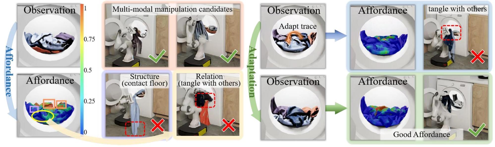

# Point-Level Visual Affordance Guided Retrieval and Adaptation for Cluttered Garments Manipulation
[[Project page]](https://garmentpile.github.io/) 
<!-- | [[Paper]](https://arxiv.org/pdf/2501.00879) | [[Video]](https://www.youtube.com/watch?v=IiOBj3ww-qA) -->

[Ruihai Wu*](https://warshallrho.github.io/), [Ziyu Zhu*](https://alwaysleepy.github.io/), Yuran Wang*, [Yue Chen](https://github.com/Cold114514), Jiarui Wang, [Hao Dong](https://zsdonghao.github.io/)

Peking University

*CVPR 2025*



## Structure of the Repository
```
# training and evaluation
/data_collection         # The data collection pipeline
/train                   # The code for training affordance
/eval                    # The code for evaluation in different scenarios
/Model                   # The code for model implementation and checkpoints

# garment pile simulation (Isaac Sim)
/Camera                  # Implementation for camera
/Garment                 # Implementation for garments
/Robot                   # Implementation for robot
/Room                    # Implementation for room
/Wash_Machine            # Implementation for washing machine
```


## Installation

To reproduce our simulation results, install our conda environment on a Linux machine with Nvidia GPU. 

1. Install Isaac Sim <br>
   Download Isaac Sim 2023.1.1. You can refer to the [official guideline](https://docs.omniverse.nvidia.com/isaacsim/latest/overview.html) and [Isaac Sim Forum](https://docs.omniverse.nvidia.com/isaacsim/latest/overview.html) to download it. 

3. Clone this repo
    ```
    git clone https://github.com/AlwaySleepy/Garment-Pile.git
    ```

4. Download ClothesNet <br>
    You can refer to [Clothsenet](https://sites.google.com/view/clothesnet) to download this garment assets and put it in your preferred local path. Then you should change the path in /config.py accordingly.
5. Install environment for PointNet++: (to do)

## Data Collection
Run the following command to generate retrieval data:
```
data_collection/retrieve_collect.sh
```
Run the following command to generate stir data:
```
data_collection/stir_collect.sh
```
Change the path of Isaac Sim to your own local path in all the shell files. <br>
Data will be stored in /data/retrieval or /data/stir in .npz form.


## Training
### Offline Training

### Finetune


## Evaluation
Run the following command to evaluate provided model.
```
/home/user/.local/share/ov/pkg/isaac-sim-2023.1.1/python.sh eval/washingmachine.py
```
Change the path of Isaac Sim to your own local path.


## Citation and Reference

If you find this paper useful, please consider staring 🌟 this repo and citing 📑 our paper:

```
@InProceedings{Wu_2025_CVPR,
      author    = {Wu, Ruihai and Zhu, Ziyu and Wang, Yuran and Chen, Yue and Wang, Jiarui and Dong, Hao},
      title     = {Point-Level Visual Affordance Guided Retrieval and Adaptation for Cluttered Garments Manipulation},
      booktitle = {Proceedings of the IEEE/CVF Conference on Computer Vision and Pattern Recognition (CVPR)},
      year      = {2025},
  }
```
