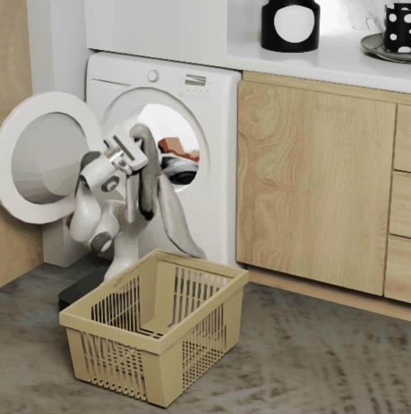
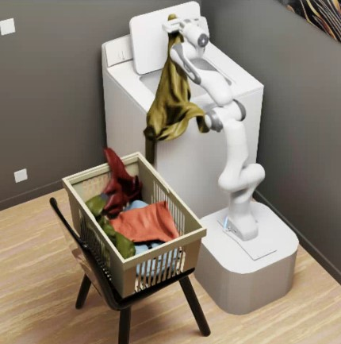

## README
설치는 garmentpile github 그대로 진행. 그대로 실행하면 physics등 안되는 부분있어서 맞춰둠.
issac-sim 2023.1.1 사용 필

각 셀 스크립트 확인,
random_flag: random pick, random place -> 학습할 때 
model_path: eval 할 때
rgb_flag: rgb 저장
gif_flag: gif 저장
TARGET_DIR : 저장 위치 설정
collect_epoch: 저장 scene 개수

/.local/share/ov/pkg/isaac-sim-2023.1.1/python.sh 로 issac-sim 실행해야됨. 
```bash
# washmachine
bash Env_Data_Collection/auto_washmachine_retrieve.sh

# basket
bash Env_Data_Collection/auto_basket_retrieve.sh
```
저장은 rgb, gif, pcd 저장 -> affordance 학습에 사용가능
- 저자한테 물어봤는데 we use about 6 RTX 4090 for data collection, and run 2 process on each GPU. It takes about 5 days to get retrieval data. 라고 함.
- 배경 지우고, 로봇이랑 garment를 한 issac-sim에서 멀티로 불러오게 코드 수정 할 수 있을 듯함.
- 데이터 모을 때 Env_Data_Collection/*.py 에서 headless
  '''simulation_app = SimulationApp({"headless": False})''' 

  
### 각 Env_Data_collection/basket, washmachin_retrive.py 로직,
3060에서 vram 애매함 + 속도 증가를 위해 현재 basket, wm 에서 배경 불러오는 부분 주석 처리. 


- garment_into_machine()
중력 방향을 시간에 따라 바꿔(x,z 성분 조절) 옷이 드럼 안으로 흘러 들어가게 함. 수백 스텝 simulation_app.update()로 시뮬레이션 진행 후 다시 표준 중력으로 복귀.
- remove_conveyor_belt()
컨베이어 프림 삭제, 문 위치 수정, 한 스텝 렌더.
- create_attach_block() / set_attach_to_garment()
그리퍼 끝에 붙을 AttachmentBlock (<< garmentlab은 point로 garment 구현해서 없으면 pick 잘 안됨) 생성 및 충돌 그룹 갱신 → 특정 3D 위치로 이동해 의류에 “부착” 처리.
- get_point_cloud_data()
몇 스텝 렌더 후 Point_Cloud_Camera로 point cloud + colors 획득. 원하면 PLY로 저장.
- pick_point(random=True)
- 랜덤/모델 기반으로 픽 점 결정.
- 모델 기반일 때 출력 분포를 검사해 “stir(휘젓기)”가 필요하면 stir()로 진입.
- 선택된 점에 attach 블록 부착 후 픽 포인트 반환.
- stir(...)
	1.	포인트클라우드 취득 →
	2.	pick_point(random=False)로 후보 결정 →
	3.	스레드로 바닥 접촉 판정 시작 →
	4.	franka.fetch_garment_from_washing_machine(...) 실행 →
	5.	그리퍼 오픈/부착 해제 →
	6.	의류 현재 포즈 측정 → **성공/실패 판정(wm_judge_final_poses)**으로 남은 의류 인덱싱 갱신.
- 모든 의류 처리 후 self.point_cloud is None이면 성공 메시지 찍고 simulation_app.close() (여기 break/return이 없어 이후 코드가 계속 돌 수 있는 점은 개선 포인트).

엔트리포인트(if __name__ == "__main__":)
	1.	env = washmachineEnv()로 위 asset(garment)/모델 전부 로드.
	2.	Franka를 잠시 비가시화, env.world.reset(), 두 카메라 initialize().
	3.	의류 유입 시퀀스: garment_into_machine().
	4.	의류 물성 튜닝: 마찰/접착 스케일 조정.
	5.	컨베이어 제거 → 부착 블록 생성/세팅.
	6.	본 루프: pick_multiple_times()로 반복 픽·플→성공여부 기록.
	7.	몇 스텝 더 진행 후 시뮬레이터 종료.

flow
- Point_Cloud_Camera → point_cloud (N×3)
- 모델 3종:
- Retrieve: 집기 난이도/상태 평가 (stir 판단 보조)
- Pick: point_cloud에서 픽 인덱스 산출
- Place: pick + 현재 점군을 입력해 플레이스 위치 산출
- Franka 래퍼가 해당 위치로 경로계획/실행.
- 판정: wm_judge_final_poses로 성공/실패 로깅 및 다음 반복 여부 결정.


<h2 align="center">
  <b><tt>GarmentPile</tt>: <br>
  Point-Level Visual Affordance Guided Retrieval and Adaptation for Cluttered Garments Manipulation</b>
</h2>

<div align="center" margin-bottom="6em">
<b>CVPR 2025</b>
</div>

<br>

<div align="center">
    <a href="https://arxiv.org/pdf/2503.09243" target="_blank">
    </a>
    <a href="https://garmentpile.github.io/" target="_blank">
    </a>
    <a href="https://github.com/AlwaySleepy/Garment-Pile" target="_blank">
    </a>
</div>

<br>


<p align="center" margin-bottom="20em">
<b>Garment-Pile Simulation Scene</b>
</p>

<p align="center">
  
  
  
</p>


## Get Started

### 1. Install Isaac Sim 2023.1.1
   Our Project is built upon Isaac Sim 2023.1.1. Please refer to the [official guideline](https://docs.isaacsim.omniverse.nvidia.com/latest/installation/download.html) to download it.

   After Download, please move the file into path '~/.local/share/ov/pkg/' and rename the file to be 'isaac-sim-2023.1.1' to adapt the path configuration of the repo.

   There are some modification need to be done in Isaac Sim's meta-file. Please refer to this [document](https://github.com/AlwaySleepy/Garment-Pile/blob/main/BUG_FIX.md).

### 2. Repo Preparation

- Clone the repo frist.

```
git clone https://github.com/AlwaySleepy/Garment-Pile.git
```

- Download *Garment* Assets

Here we use *Garment* Assets from GarmentLab. Please refer to [Google_Drive_link](https://drive.google.com/drive/folders/1EWH9zYQfBa96Z4JyimvUSBYOyW615JSg) to download **Garment** folder and unzip it to 'Assets/'.

### 3. Environment Preparation

- **Isaac Sim Env** Preparation

For convenience, we recommend to provide an alias for the python.sh file in Isaac Sim 2023.1.1.
```bash
# 1. open .bashrc file
sudo vim ~/.bashrc

# 2. add following part to the end of the file
alias isaac_pile=~/.local/share/ov/pkg/isaac-sim-2023.1.1/python.sh

# 3. save file and exit.

# 4. refresh for file configuration to take effect.
source ~/.bashrc
```

Install necessary packages into Isaac Sim Env.

```bash
isaac_pile -m pip install termcolor plyfile
```

- **Model Training Env** Preparation

create new conda environment

``` bash
conda create -n garmentpile python=3.10
```

Install necessary packages into Model Training Env.

``` bash
conda activate garmentpile

# CUDA version should be 11.8 or less, but no 12.X
pip install torch==2.1.2 torchvision==0.16.2 torchaudio==2.1.2 --index-url https://download.pytorch.org/whl/cu118

pip install -r requirements.txt
```

### 4. Repo Structure Explanation

    📂 ProjectRoot
        # VS Code Configuration Files
    ├── 📁 .vscode
        # Assets used in Isaac Sim
    ├── 📁 Assets
        # Isaac Sim Env Configuration, including Camera, Robot, Garment, etc.
    ├── 📁 Env_Config
        # Used for train_data collection
    ├── 📁 Env_Data_Collection
        # standlone environment with pre-trained model
    ├── 📁 Env_Eval
        # Used for fintuning model
    ├── 📁 Env_Finetune
        # Model training code
    ├── 📁 Model_Train
        # repo images
    ├── 📁 Repo_Image

## StandAlone Env

In our project, we provide three garment-pile scenes: **washingmachine**, **sofa**, **basket**.

You can directly run the three environment based on the file in *'Env_Eval'* folder.

The retrieve, pick, place procedure all rely on pre_trained model.

**[ATTENTION!]**
**If you find failure of assets loading in simulation, please enter "Env_Config / Config / xx_config.py" to check assets loading path.**

```bash
# washmachine
isaac_pile Env_Eval/washmachine.py

# sofa
isaac_pile Env_Eval/sofa.py

# basket
isaac_pile Env_Eval/basket.py
```

## Data Collection

Run the following command to generate retrieval data:

```bash
# washmachine
bash Env_Data_Collection/auto_washmachine_retrieve.sh

# sofa
bash Env_Data_Collection/auto_sofa_retrieve.sh

# basket
bash Env_Data_Collection/auto_basket_retrieve.sh
```

Run the following command to generate stir data:

```bash
# washmachine
bash Env_Data_Collection/auto_washmachine_stir.sh

# sofa
bash Env_Data_Collection/auto_sofa_stir.sh

# basket
bash Env_Data_Collection/auto_basket_stir.sh
```

There are some flags you can define manually in .sh file. Please check .sh file for more information. (such as, rgb_flag, random_flag, etc.)

## Model Training

Training Data are all collected in 'Data' file.

```bash
# activate conda env
conda activate garmentpile

# run any .py file in 'Model_Train' folder. remember to login in wandb
# e.g.
python Model_Train/WM_Model_train.py
```

## Finetune

We provide washmachine place model finetune code as example in 'Env_Finetune' folder.

you can run the .sh file directly to see finetune procedure.

## Citation and Reference

If you find this paper useful, please consider staring 🌟 this repo and citing 📑 our paper:

```
@InProceedings{Wu_2025_CVPR,
      author    = {Wu, Ruihai and Zhu, Ziyu and Wang, Yuran and Chen, Yue and Wang, Jiarui and Dong, Hao},
      title     = {Point-Level Visual Affordance Guided Retrieval and Adaptation for Cluttered Garments Manipulation},
      booktitle = {Proceedings of the IEEE/CVF Conference on Computer Vision and Pattern Recognition (CVPR)},
      year      = {2025},
  }
```
